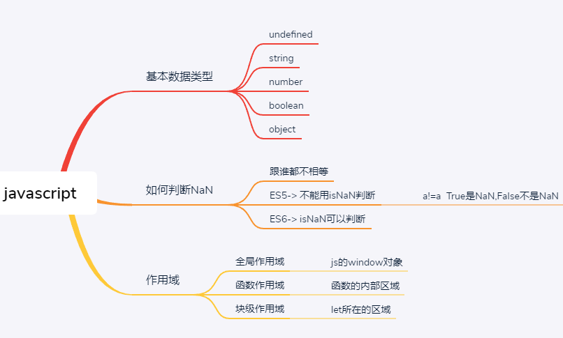

##### javascript基本数据类型

undefined

string

boolean

number

object

##### 如何检查NaN

isNaN->ES5 NaN 并不靠谱，ES6修复了这个问题，跟谁都不相等（包括它本身）

```
# ES6  
isNaN()
# ES5
a!=a
false -> 不是NaN
true -> 是NaN
```

##### 作用域

全局作用域：整个js

函数作用域：函数的内部

块级作用域：let



##### IIFE匿名函数

```
(funxtion(){
	var a = 11;
})();
```

##### 闭包

```javascript
function show(){
	var num = 1;
  return function(){
    console.log(num)
  }
}
var show2 = show();// num没有释放的现象叫做闭包
show2();
```

##### IIFE和闭包

```javascript
var arr = []
# 匿名函数自执行
for(var i = 0;i < 3; i++){
	(function(i){
		arr[i] = function(){
      return i
    }
	})(i);
}
console.log(arr[0]());
console.log(arr[1]());
console.log(arr[2]());
```


