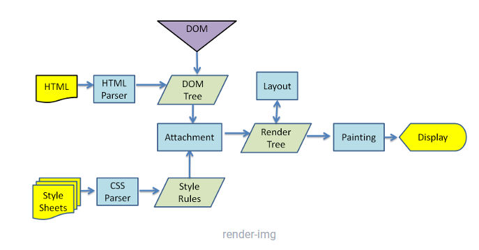

1. ##### 浏览器渲染Js,html,css的顺序

   

   html解析器和css解析器同时进行，分别解析成dom树和css规则树，然后这来给你个树合并生成一个附件，附件生成渲染树和layout然后进行绘制。

   ###### css阻塞

   css会阻塞渲染树的构建，但不会阻塞DOM构建。在css规则树没有完成前页面不会开始渲染，页面一片空白。js虽然会阻塞后续DOM构建，但是前面已就绪的内容会进行渲染。css不会阻塞DOM但会阻塞后面js的执行，从而间接阻塞完整DOM的构建。

   ###### js阻塞

   默认会阻塞DOM和渲染树的构建。

   HTML解析器在遇到脚本文件时，默认会停下来去获取脚本，然后执行，期间阻塞DOM构建。

   加载顺序是自上而下，但渲染流程却是如图，js最好放在最下面。

   ```html
   # CSS媒体类型和媒体查询
   <link href="style.css"    rel="stylesheet">
   <link href="style.css"    rel="stylesheet" media="all">
   <link href="portrait.css" rel="stylesheet" media="orientation:portrait">
   <link href="print.css"    rel="stylesheet" media="print">
   <link href="other.css" rel="stylesheet" media="(min-width: 40em)">
   ```

   

2. ##### react dom diff 算法，list比较首先比较的是什么

3. ##### 为什么react要做成异步的

4. ##### 对象的{...}解构，是rest吗

5. ##### 自己实现一个Symbol Interator

   ```
   // 给一个对象设置Symbol Interator
   var obj = {
     *[Symbol.iterator]() {
       yield 1;
       yield 2;
       yield 3;
     }
   };
   ```

   

6. ##### options头是在什么时候会进行发送

7. ##### sessionStorage在两个tab窗口可以共享吗

8. ##### localStorage存放的只能是string类型

9. ##### 写一个0-100的正则表达式

   ```
   /^(?:[1-9]?\d|100)$/
   ```

   

10. ##### linux中怎么查看内存和磁盘

11. ##### meta标签用过吗？都用来做什么？

    